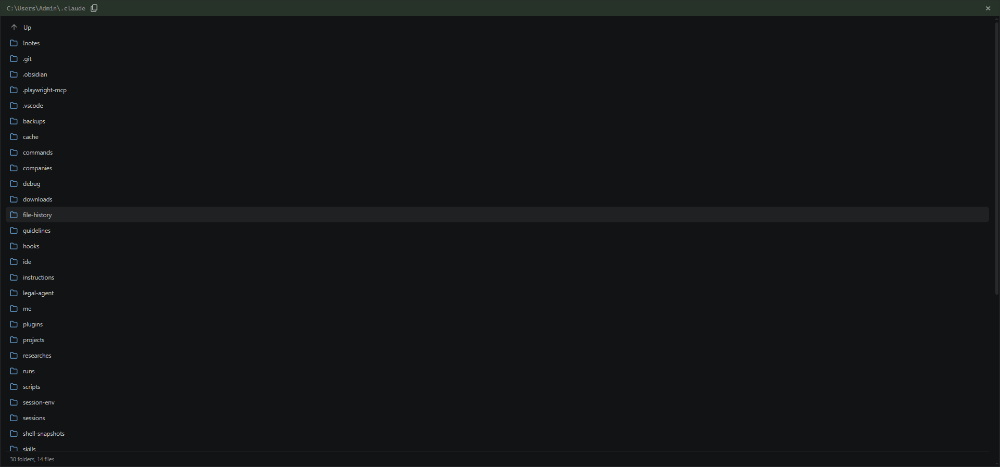
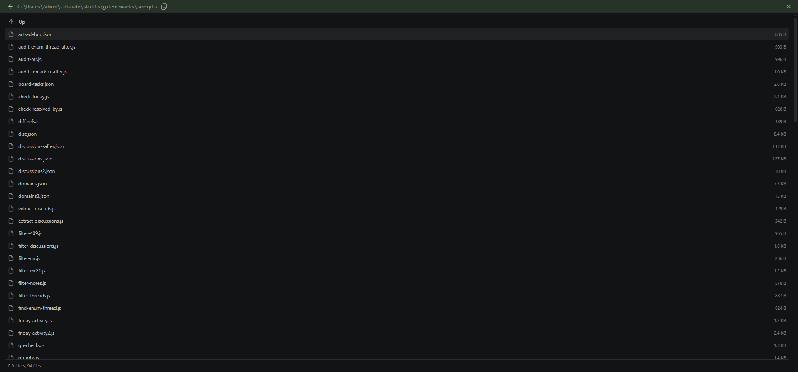
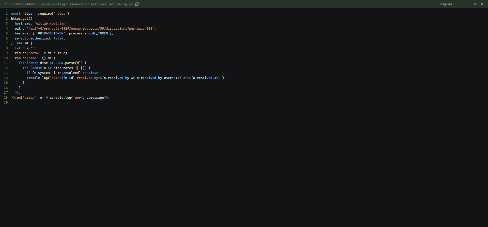
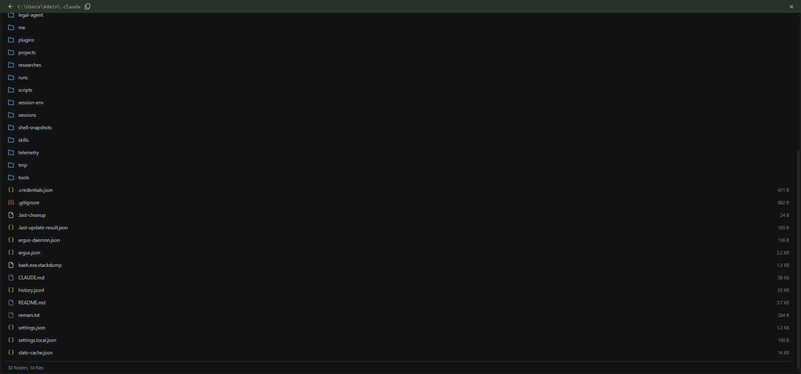

# Directory preview for a clicked path

Status: implemented, verified end-to-end in the browser. Not committed.

## The report

A path in the transcript rendered as a link, and clicking it opened the previewer on
`Error reading file: EISDIR: illegal operation on a directory, read`. Asked for: render
a directory listing instead, in the form the Workspace History "Browse" tab already has,
sharing that component and logic.

Reported line (session `4c7a8be2-8006-4b43-b92d-084f96dfa1e6`):

```
Скрипты, которыми это делалось, лежат в C:\Users\Admin\.claude\skills\git-remarks\scripts\
```

## Two separate defects in that one line

Measured, not inferred - `scripts/probe-path.js` runs the real `FILE_PATH_RE` over the
exact string and stats what comes out:

| # | Defect | Status |
|---|--------|--------|
| 1 | The link covers only `C:\Users\Admin\.claude`, not the folder the sentence names. The final segment `scripts` has no dot, so the regex backtracks to the last `.something` and stops at `.claude` | **fixed** (second pass, after the user confirmed the whole path should link) |
| 2 | Whatever directory it lands on renders as an EISDIR error | **fixed** |

Confirmed in the live DOM, not just by regex: the anchor is
`<a class="file-path-link" title="Open C:\Users\Admin\.claude">`, with
`\skills\git-remarks\scripts\` sitting outside it as plain code text.

## What changed

- `src/backend/filePreview.ts` - `readFilePreview` stats first; a directory returns
  `{path, content:'', entries, parent, truncated}` instead of reading it. Both hosts
  (WS `session.ts` and the extension's `ChatPanel`) spread the result, so one change
  covers both. Files included, not just sub-folders: the Browse tab lists directories
  because it picks a workspace, but a preview of `.../scripts` whose 94 files were
  hidden would be an empty box. Folders first, then files, case-insensitive.
- `webview/src/components/shared/FolderList.tsx` + `folderList.module.css` - the row,
  the icons and the sizes, shared. Class names kept (`browseRow`, `browseName`,
  `folderIcon`, `upIcon`) because `e2e/workspace-browse*.spec.ts` locate rows by
  `[class*="browseName"]` and a CSS-module local name survives into the generated class.
- `WorkspaceHistoryModal.tsx` - now renders `BrowseRow`/`UpRow`; its local `FolderIcon`
  and the moved CSS deleted.
- `FileViewerModal.tsx` - a `dir` frame renders `DirListingBody`. Rows reuse the
  previewer's own stack (`openPath`), so folder -> folder -> file all push frames and
  Back walks out. Encoding select and "Open in editor" hidden for a directory.
- `PreviewContext.tsx` - new resolved kind `dir`. Never opened directly: only the host
  can tell a folder from a file, so a `path` request opens optimistically as a file and
  **changes kind** when the reply carries `entries`.

## Caps and costs

`MAX_DIR_ENTRIES = 1000`; the whole listing crosses the wire in one frame, and a
`node_modules` or a downloads folder would otherwise be the largest thing Argus sends
(same rule as [../../common/large-tool-payloads.md](../../common/large-tool-payloads.md)).
Sizes are stat'd only for entries that survive the cap, so a huge folder costs one
`readdir` rather than 50k stats.

Measured (`scripts/probe-cap.ts`, synthetic 1230-entry folder): shown 1000, truncated
230, 1000 + 230 == 1230, 26ms. Real `node_modules` (179 entries): 8ms.

## Verified

`scripts/probe-preview.ts` against the shared reader: the reported dir, the folder
actually meant, a trailing separator, forward slashes, a drive root (`parent` absent -
nowhere up), a relative path inside the workspace, and three controls that must NOT
become listings (a file, a missing path, a path outside the workspace).

In the browser on the reported session, clicking the real link:

-  `C:\Users\Admin\.claude` -> 30 folders, 14 files
-  walked down to `...\git-remarks\scripts` -> 0 folders, 94 files with sizes
-  clicked `check-resolved-by.js` -> syntax-highlighted file, encoding select back
- Back -> returns to the `scripts` listing, encoding select hidden again

## Defect 1: linking the whole path

`FILE_PATH_RE` (filePath.tsx) and `WIN_PATH_RE` (markdown.tsx) widened together, as
[../../common/markdown-file-paths.md](../../common/markdown-file-paths.md) requires.
The extension requirement is dropped **only on the Windows branch**, where the drive
letter is the evidence that the text is a filesystem path. The final segment must be
non-empty and must not end in a dot, which keeps a sentence's full stop, the elision
`C:\...` and a bare `C:\` out of the link; an optional trailing separator is allowed.

**The slash branches were widened the same way and reverted.** A URL path in prose is
shaped exactly like a directory, and the corpus that said it was safe ("and/or", "24/7")
missed the class that actually occurs: rendering the reported session produced links to
`/api/probes/` (out of `GET /api/probes/headers`) and
`/api/v4/projects/6829/merge_requests/99/discussions/`. A leading slash is not evidence
of a filesystem, and a bare relative path has no evidence at all. Only the real
transcript caught this; a synthetic corpus will not, because the bait has to be prose
somebody actually wrote.

`scripts/probe-live-regex.js` pulls both literals **out of the source files** and runs
the pair in sequence (escape pass, then linkifier), so it cannot pass against a probe
that has drifted from the shipped code. 14 cases, including the two API paths above.

The widening then broke its own reply matcher, which is worth remembering: the request
now carries a trailing separator, the host resolves it away, and
`got.endsWith(wanted)` therefore rejected the answer to its own question. The modal
spun until the 20s timeout. Fixed with `matchesRequestedPath()` in
`webview/src/utils/path.ts`, used by both `PreviewContext` and `FileViewerModal`.
**Changing what a link matches changes what gets requested**, so every matcher keyed on
that string has to be re-checked.

## File-type icons

Asked for next: icons per extension, "как в VS Code". VS Code's default theme (Seti) is
mostly **glyph + colour**, and in a list the colour is what the eye sorts by, so that is
what `webview/src/utils/fileIcon.ts` reproduces: the real eight-colour Seti palette
(`#519aba` blue, `#cbcb41` yellow, `#e37933` orange, `#cc3e44` red, `#8dc149` green,
`#a074c4` purple, `#6d8086` grey, `#d4d7d6` plain) over 8 glyphs
(doc / code / braces / image / archive / config / shell / db), drawn in the same 24x24
stroke style as the existing folder and back icons.

**Inline SVG in the bundle, not an icon font.** A font (Seti, file-icons) would be an
emitted asset, and the daemon serves a fixed static allowlist (`/`, `/webview.js`,
`/webview.css`, `/argus-icon.ico`), so it would 404 in browser mode. Bundling
`vscode-icons`' SVGs has the same problem in Vite lib mode.

`fileIconFor(name)` is pure and data-only, so `scripts/probe-icons.ts` covers it without
rendering: last dot wins (`bundle.tar.gz` is a gz), a leading dot is a **name** not an
extension (`.corp-account` falls back to the default rather than looking up an extension
`corp-account`), whole-name matches are case-insensitive (`Dockerfile`), unknown
extensions and dotless names fall back.

Two gaps found only by rendering a real folder rather than reading the table:

- `.js` and `.json` were both yellow `code`, so a scripts folder (86 of 94 files) went
  back to being one repeated icon. JSON now gets its own `braces` glyph, which is what
  VS Code does too.
- `history.jsonl` fell through to the plain default; `jsonl`/`ndjson` added.



## Regression runs

| Suite | Result |
|-------|--------|
| `file-path-links`, `file-path-bang-folder`, `file-path-hyphen-dotfile`, `url-not-file-path`, `file-viewer-modal` (mock) | 36 passed |
| `modal-persistence`, `preview-navigation`, `html-preview`, `tool-image-preview`, `dialog-state` (mock) | 24 passed |
| `workspace-browse`, `workspace-browse-edit`, `file-preview-copy` (integration) | 5 passed |

The workspace-browse specs matter beyond their subject: they locate rows by
`[class*="browseName"]`, so they are what proves the shared-component extraction did not
rename anything out from under them.

The icon work landed after those runs; it is presentational and additive (a new
`FileTypeIcon`, `FileIcon` untouched), and the Browse tab was re-checked live afterwards
(43 rows, 42 folder icons). The suites above have **not** been re-run since.

Reported session after the change: 8 links, down from 11 with the slash branches in and
up from 6 real ones before. The two new links are both real directories, and the boxed
one opens straight on `...\git-remarks\scripts` (94 files) instead of on `.claude`.

## Failures found while running the suite (all pre-existing)

Five spec failures surfaced while verifying this work. **None was caused by it** - the only
backend file this task changes is `filePreview.ts`, and `git diff HEAD --stat` over
`channel.ts`, `sessions.ts`, `cliHandler.ts` and both browser shims is empty. Each is
written up in the task folder that owns the feature:

| Spec | Cause | Where |
|------|-------|-------|
| `usage-indicator-integration:105` | loop waited for a third frame that has no sender; **fixed**. Two further diagnoses were wrong and the intermittency is still unexplained | [../usage-limits-indicator/notes.md](../usage-limits-indicator/notes.md) |
| `account-usage-integration:132` | guard probed the live API, the server's own fetch then 429'd; **fixed** (skip on the no-data state) | [../account-and-usage/notes.md](../account-and-usage/notes.md) |
| `getAccountUsage` sending zero frames | `execFile` throws synchronously on `spawn UNKNOWN`, rejecting a promise documented as always resolving; **fixed**, and a real product bug (the modal spun forever) | [../../common/request-reply-invariant.md](../../common/request-reply-invariant.md) |
| `session-active-marker-integration:73` | waited on a list that is fetched once on mount; **fixed** (drive the Refresh button) | [../session-active-marker/notes.md](../session-active-marker/notes.md) |
| `version-skew.spec.ts` (mock) | a real `workspaceInfo` reply clobbered the injected client version; **fixed** (drop `getInfo` too) | [../version-skew-direction/notes.md](../version-skew-direction/notes.md) |
| `tool-image-preview-integration:22` | transcript lookup missed data that was on disk; **unexplained**, passes in isolation | [../image-preview-from-tool-result/notes.md](../image-preview-from-tool-result/notes.md) |

Artifacts preserved here, because `test-results/` is wiped at the start of every run:
[failure-usage-indicator/](failure-usage-indicator/), [failure-tool-image/](failure-tool-image/),
[failure-active-marker/](failure-active-marker/), [failure-version-skew/](failure-version-skew/).

The recurring shape is worth naming: **every one of them breaks only under full-suite load
and passes in isolation**, and two of the six are the CLI transcript not being readable when
a test assumes it is. That is one problem, not six flakes.

## Remaining work

- No e2e spec for either half yet. Shape: mock project (the `readFilePreview` round trip
  reaches the real backend there, as `modal-persistence.spec.ts` already relies on),
  inject a message carrying a directory path, click it, assert
  `[data-testid="dir-listing"]` rows plus the footer counts; **control**: a file path in
  the same message still opens as code, so "everything renders as a listing" cannot pass.
  For the regex, a case pinning an API path as *not* a link belongs there too. Run the
  red first.
- CLAUDE.md not yet updated (no commit yet).
